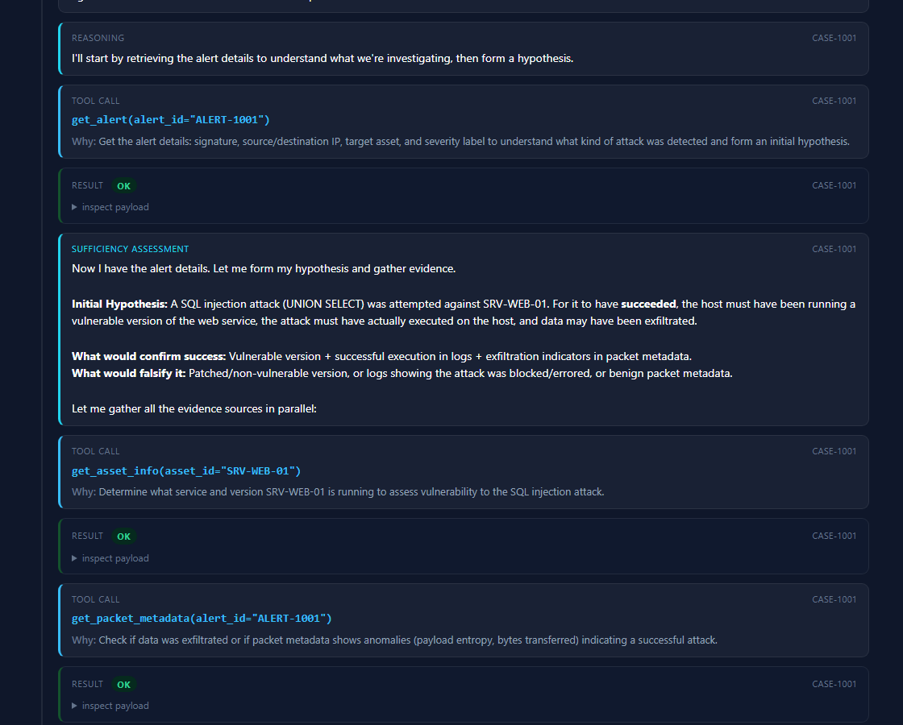

# Autonomous SOC Investigation & Response Agent

An autonomous SOC agent that takes a simulated NIDS/Suricata alert and determines
whether the attack **actually succeeded** — by correlating the alert against asset,
vulnerability, configuration and log evidence, rather than trusting the alert's
severity label.

It then takes a sandboxed firewall action when justified, verifies the action
took effect by re-reading state from disk, and reconsiders its conclusion when
new evidence, a tool failure, or a human override arrives.

> A "critical" SQL-injection signature against a host patched two years ago whose
> logs show a 403 is a **false alarm**. A "low" signature against an unpatched host
> that then shipped 2 MB outbound is a **breach**. The severity label does not
> decide; the correlated evidence does.

## Start here



That is the whole idea in one frame: a tool call, **the reason the agent gave for
making it**, the result, and the next decision that follows from it. The agent
receives eleven tool schemas and picks its own calls and ordering at runtime —
nothing about the sequence is scripted.

**The single most informative artefact is
[`reports/CASE-1001.md`](reports/CASE-1001.md), section 2, steps 8-10.** The agent
submits its assessment claiming the host is patched; the tool **refuses it**,
because it checked two of the host's three CVE-covered services; the agent looks
up the third and resubmits. Both the refusal and the correction are steps in the
evidence chain.

### The one rule the guards enforce

Every guard refuses the **form** of a claim, never its content. Section 7.2's
three positive factors are *existential* — one witness settles them — while its
three negatives are *universal*, and "I looked and found nothing" is meaningless
without a stated scope. So the bus will not accept "outside **all** affected
ranges" from someone who checked **some** of them, and it never decides whether
a given version is actually in range: that comparison is the agent's, and it is
the entire point.

---

## Quick start

```bash
cp .env.example .env          # then put your key in SOC_API_KEY
python selfcheck.py           # 99 behavioural checks, no API key needed
python compliance.py          # 22 guardrail checks, no API key needed
python run_all.py             # run all seven scenarios against the model
python -m http.server 8000    # then open http://localhost:8000/viewer.html
```

`run_all.py` accepts scenario numbers: `python run_all.py 3 6`.

A presenter's walkthrough is in **[DEMO.md](DEMO.md)**.

**The viewer must be served over HTTP**, not opened as a `file://` URL — browsers
block `fetch` on local files, so the trace JSON will not load.

---

## What the agent actually does

```
INGEST_ALERT → HYPOTHESIZE → GATHER_EVIDENCE → DETERMINE_OUTCOME → ACT → VERIFY
                    ↑                                                      │
                    └──────────── reconsider(case, event) ←────────────────┘
                         NEW_EVIDENCE │ HUMAN_OVERRIDE │ RELATED_CASE
```

The agent is given the tool schemas and **chooses its own calls and their order at
runtime**. There is no scripted sequence anywhere in the decision path. What the
orchestrator does *not* leave to the model is only this:

- **the arithmetic** — confidence is computed deterministically in Python from the
  evidence classes the agent declared, so a demo run is reproducible and
  "where did 0.85 come from" has a one-line answer;
- **the action policy** — the agent is told the standing policy and held to it;
- **guardrail 6** — a human override is never re-overridden by an automated action.

### The correlation that matters

The CVE knowledge base is keyed by **service name only** and contains no
per-host patch status. It cannot tell the agent whether a host is patched,
because a real CVE database does not know what *your* host runs. So the agent
must join two independent facts and say the join out loud:

```
get_asset_info(SRV-DB-02)      → mysql 5.7.21 is running
get_vulnerabilities("mysql")   → CVE-2023-21980 affects >=5.7.0,<5.7.30
                               → 5.7.21 is INSIDE that range → vulnerable
```

That reasoning step is visible in the trace, and it is the thing being graded.

The configuration source follows the same rule, and it had to be corrected to do
so. `config_state.json` originally shipped a `prevents_exploitation` boolean per
surface — exactly what §5.1 forbids for the CVE KB, for exactly the same reason:
a pre-computed verdict means the join never happens in the trace. It was removed.
The file now describes controls (`hr_portal_ro` holds `SELECT` on `hr_public.*`
only) and leaves it to the agent to decide whether that stops a `UNION SELECT`
against `hr_salary`.

---

## The seven scenarios

| # | Scenario | Expected outcome | Demonstrates |
|---|---|---|---|
| 1 | False alarm, patched host | `FAILED`, no action | Severity label does not drive the verdict |
| 2 | True positive, unpatched | `SUCCEEDED`, block + verify | Full happy path, real state mutation |
| 3 | Delayed evidence | `INCONCLUSIVE` → `SUCCEEDED` | **Re-hypothesise**: goes and investigates a *second host* |
| 4 | Human override | `SUCCEEDED` → `OVERRIDDEN_BENIGN` | Unblocks, preserves both views, does not re-block |
| 5 | Multi-alert correlation | two cases → `SUCCEEDED` | Case B discovers case A via `get_related_alerts` |
| 6 | Tool failure | `INCONCLUSIVE` + precautionary block | Notices failure ≠ "no evidence", routes around it |
| 7 | Configuration prevents exploitation | **XFAIL (declared)** | A correlation the scoring model has no term for — kept because the gap is the finding |

**Scenario 6 is the sharpest demonstration of the design.** The raw evidence
scores 0.90 — `SUCCEEDED`. But `get_server_logs` failed, so the degraded-evidence
clamp pulls the score to 0.65 and the outcome to `INCONCLUSIVE`, with the missing
source cited explicitly as the reason for the ceiling. The agent does not get to
claim a confident verdict on a half-read evidence base.

**Scenario 7 is a declared limitation, kept on purpose.** The host runs a
version squarely inside CVE-2023-21980's range and the logs show the injected
`UNION SELECT` reaching the database — on asset and vulnerability evidence alone
it reads exactly like scenario 2. What separates them is configuration: the
portal connects as `hr_portal_ro`, which holds no privilege on the targeted
table, so MySQL returns `ERROR 1142` and zero rows.

The agent finds all of this. It calls `get_configuration` unprompted and its
report names the grant restriction as the reason the attack failed. But
§7.2 has no factor for a configuration control, so that finding cannot reach the
score: the case lands at 0.40 `INCONCLUSIVE` instead of `FAILED`, and the
harness reports `XFAIL`. The scenario is kept, and its assertion left failing,
because a documented gap between what the agent can establish and what the
scoring model can represent is worth more than a scenario trimmed to fit.

A `config_prevents_exploitation` factor was built and reverted — see
`Toknow/DECISIONS.md` Part 22 for why, which is the more interesting half.

**Scenario 3 is the sharpest demonstration of adaptation.** The injected
lateral-movement entry names a second host. The agent must *want* to go look at
that host — re-entering the loop at `HYPOTHESIZE`, not at `DETERMINE_OUTCOME` —
because the value is in gathering new evidence, not in re-scoring old evidence.

---

## Confidence scoring

Starts at `S = 0.50` (no prior). Each factor applies at most once:

| Evidence finding | Δ |
|---|---|
| Running version falls inside a CVE's affected range | +0.25 |
| Server logs show the attack actually did something | +0.25 |
| Packet metadata shows exfil / payload-anomaly indicators | +0.15 |
| A related alert on the same asset corroborates | +0.15 |
| Running version outside all affected ranges (patched) | −0.30 |
| Server logs clean across the relevant window | −0.25 |
| Packet metadata benign | −0.10 |

Clamped to `[0.05, 0.95]`. If **any** evidence source failed or was unavailable,
additionally clamped to `[0.35, 0.65]` — this is what forces Scenario 6 to
`INCONCLUSIVE` for the right reason.

`S ≥ 0.75` → `SUCCEEDED` · `S ≤ 0.25` → `FAILED` · otherwise `INCONCLUSIVE`.

**Action policy:** `SUCCEEDED` → block. `INCONCLUSIVE` on a **critical** asset →
block tagged `precautionary` (containment under uncertainty, explicitly *not* a
verdict). `INCONCLUSIVE` elsewhere → flag for analyst. `FAILED` → nothing.

---

## The sandbox is real (within its boundary)

No real network calls, no real firewall, no real credentials. But inside the
sandbox the mutation is genuine and the verification genuinely depends on it:

- `block_ip()` **writes** `fixtures/run/firewall_state.json`
- `check_firewall_state()` **reads that same file back from disk**

After every action the orchestrator independently re-reads the file and compares
observed state to what the policy expected. That assertion cannot be satisfied by
the agent merely claiming it blocked something.

**Fixtures are immutable; the working copy is not.**
`fixtures/seed/` is pristine and committed. `fixtures/run/` is gitignored and is
what every tool touches. `reset_sandbox()` restores it before **every** scenario
run, so runs are reproducible.

---

## Layout

```
soc_agent/
  config.py       paths, model/provider config, .env loading
  sandbox.py      seed→run reset, explicit JSON read/write
  tools.py        the 10 agent-facing tool implementations
  schemas.py      tool schemas (Anthropic shape + OpenAI converter)
  toolbus.py      THE wrapper: trace logging, fault injection, degraded tracking
  confidence.py   deterministic scoring + action policy
  llm.py          provider layer (OpenAI & Anthropic surfaces)
  prompts.py      system prompts — where the autonomy lives
  agent.py        the state machine, and the single reconsider()
  control.py      demo-side tools (NOT exposed to the agent)
  report.py       the mandatory 7-section report
scenarios/        the seven scenario definitions + expected trajectories
fixtures/seed/    pristine evidence, human-readable, committed
traces/           saved traces — these feed the viewer
reports/          generated per-case markdown reports
viewer.html       single-file trace replay UI (Swiss/Minimalism, dark)
vendor/motion.js  Motion, vendored and pinned - the viewer has NO external refs
run_all.py        evaluation harness
selfcheck.py      99 behavioural checks, no API key required
compliance.py     22 guardrail checks, no API key required
rebuild_reports.py  regenerate reports from saved traces, no model run
DEMO.md           presenter's walkthrough
Toknow/           decision & problem log — every decision and every problem hit
```

## Configuration

| Variable | Purpose |
|---|---|
| `SOC_API_KEY` | Gateway API key |
| `SOC_BASE_URL` | API base URL |
| `SOC_MODEL` | Model id |
| `SOC_API_STYLE` | `openai` (`/chat/completions`) or `anthropic` (`/messages`) |

The provider is one config line. See `Toknow/DECISIONS.md` D-002 for why the
build runs on a third-party gateway rather than the Claude API, and how to
switch back.

---

## Verification

`python compliance.py` runs 22 structural checks with no API key. These make
"the decision logic is not scripted" a *checkable* claim rather than an
assertion: no outcome branches keyed on scenario identity, no code branching on
the alert's severity label, outcome values produced only by `confidence.py`, the
CVE KB carrying no per-host patch status, control-plane tools absent from the
agent's toolset, only `sandbox.py` touching `fixtures/seed`, and the §7.2
constants matching the spec exactly.

`python selfcheck.py` runs 99 behavioural checks with no API key: sandbox reset, every tool's
success and miss paths, the block→verify round trip against the real file,
fault injection persistence across retries, every scoring boundary, the action
policy matrix, schema/implementation agreement, guardrail 6 enforcement, and
report structure.

`python run_all.py` asserts, per scenario: final outcome class, whether an action
fired, whether reconsideration fired, that the expected tools were among those
called, final case status, the precautionary flag, and that firewall verification
matched policy. Tool *ordering* is deliberately not asserted — pinning a sequence
would re-introduce exactly the scripted behaviour the design forbids.

Assertions are **phase-scoped** where timing matters. Scenario 3 asserts that
`get_vulnerabilities("mysql")` happened *before the first conclusion*, not merely
somewhere in the trace — a whole-trace search passes a run that checked the wrong
service first and corrected only later. Scenarios 3 and 5 additionally assert
they **gathered new evidence** after reconsidering rather than re-scoring what
they already had (16 and 10 new tool calls respectively; a scenario with no
reconsideration scores 0, which is the negative control).

### The four guard families

Every guard refuses the **form** of a claim, never its content. §7.2's three
positive factors are *existential* (one witness settles them); its three
negatives are *universal* ("I looked and found nothing" is meaningless without a
stated scope). Each family enforces that distinction on a different axis:

| family | refuses |
|---|---|
| `check_preconditions` | any factor drawn from a source that never returned `ok` |
| `check_version_patched_coverage` | `version_patched` claimed from a subset of the host's KB-covered services |
| `check_negative_scope` | `logs_clean` from a window not containing the alert (or a known sibling); packet factors not grounded in this case's own alert |
| `check_sibling_verdict_conflict` | `logs_clean` when a sibling case already concluded `SUCCEEDED` on the same asset inside that window |

None inspects evidence *content* — they compare a declared factor against what
was read (a status, a service list, a timestamp, a stored outcome). A rule like
"SQLi alerts must check SQL services" would be the line; "you cannot say *all*
after checking *some*" is not.

The refuse/resubmit cycle is **bounded**: after three refusals the bus stops
arguing, drops the factors the guards named, scores what survives, and records an
**impasse** in the report. An unbounded cycle grows the conversation every round
without adding evidence.

The guards are verified **load-bearing, not merely wired**: each is monkeypatched
to a no-op and the suite must fail. Ablating `check_preconditions` breaks 4
checks, `check_version_patched_coverage` 2, `check_negative_scope` 3; restoring
returns to 0. Fixture invariants are adversarially tested the same way —
injecting a row implying successful attacker activity into a scenario that must
start `INCONCLUSIVE` makes `compliance.py` fail, verified for both Scenario 3 and
Scenario 5 case A.
