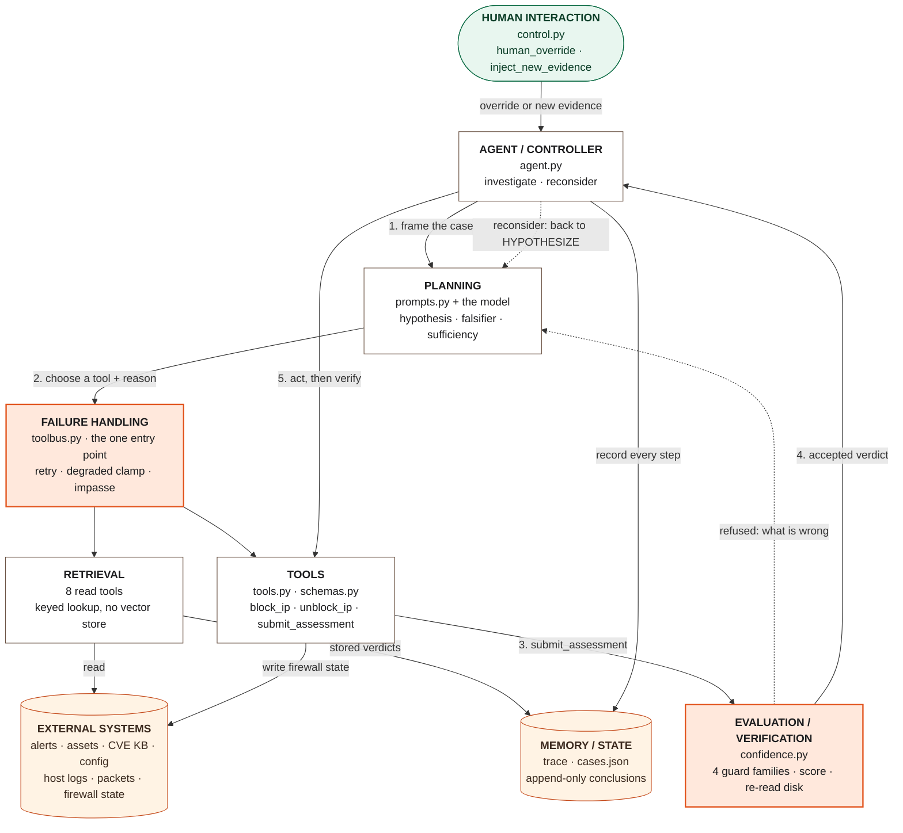
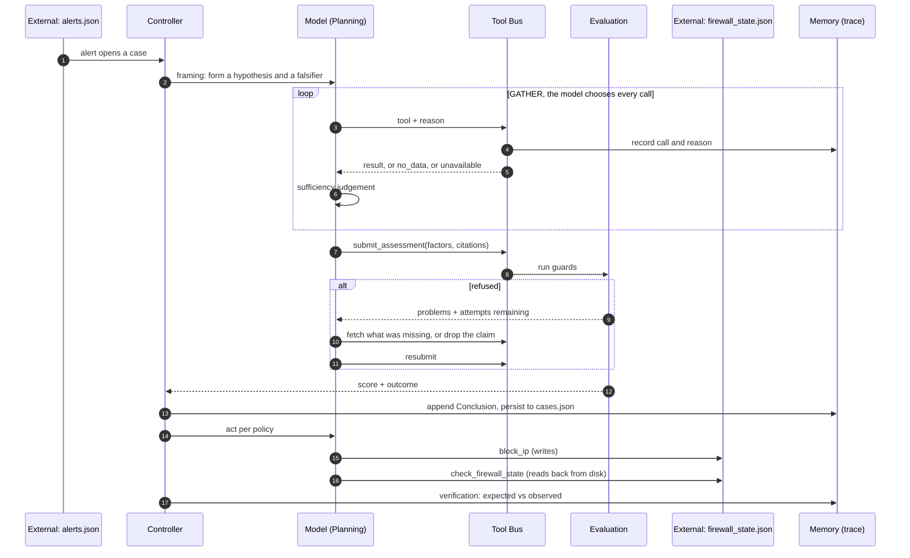

# System Architecture

The Autonomous SOC Investigation & Response Agent takes a simulated intrusion
alert and decides whether the attack actually succeeded, then acts on that
answer and verifies its own action took effect.

This document covers the nine architectural components, how they connect, and
the three paths a case can take through them. Every component is mapped to the
file and function that implements it. Rationale for individual decisions lives in
[`Toknow/DECISIONS.md`](../Toknow/DECISIONS.md).

---

## Architecture diagram



<details>
<summary>Plain-text version, with more detail (LLM client and outputs shown)</summary>

```
   HUMAN INTERACTION ─────────────── event ──────────────────┐
   control.py: human_override · inject_new_evidence          │
                                                             v
 ┌─────────────────────────────── AGENT ─────────────────────────────────────┐
 │                                                                            │
 │   AGENT / CONTROLLER  agent.py ──framing──> PLANNING  prompts.py + model   │
 │   Investigation · Case             ^            │  hypothesis, falsifier  │
 │   investigate() · reconsider() ────┘            │  per-call sufficiency   │
 │        │    ^          (re-enters at HYPOTHESIZE)v                         │
 │        │    │                              LLM CLIENT  llm.py              │
 │        │    │                                    │ chooses tool + reason   │
 │        │    │   ┌──────── TOOL BUS  toolbus.py ──v───────────────────┐    │
 │        │    │   │  FAILURE HANDLING wraps every call:                │    │
 │        │    │   │   fail_tools · retry · degraded clamp · impasse    │    │
 │        │    │   │                                                    │    │
 │        │    │   │  RETRIEVAL (8 read tools)   TOOLS (act + submit)   │    │
 │        │    │   └───────┬──────────────────────────┬─────────────────┘    │
 │        │    │           │ reads                    │ submit_assessment    │
 │        │    │           │                          v                      │
 │        │    └──accepted─┼───────── EVALUATION / VERIFICATION  confidence.py│
 │        │                │          guards · score() · decide_action()     │
 │        │ policy action  │          refused ──> problems back to the model │
 │        v                │                                                 │
 │   block_ip / unblock_ip │                                                 │
 │                         │                                                 │
 │   MEMORY / STATE  trace.py · cases.json · Case.conclusions  <── every call│
 └─────────────────────────┼──────────────────────────────────┬──────────────┘
                           v                                  v
   EXTERNAL SYSTEMS  fixtures/run/                    OUTPUTS
   alerts · assets · cve_kb · config · logs ·         report.py → reports/*.md
   packets · firewall_state (read AND written)        viewer.html
```

</details>

---

## The nine components

### 1. Agent / Controller

**Files:** `soc_agent/agent.py`

The controller owns a case from alert to report. It does not decide *what* to
investigate; it runs the phases and hands control to the model inside each one.

| Element | Role |
|---|---|
| `Case` | One alert, one case. Holds status, the list of `Conclusion`s, actions, verifications, and whether an override is active. |
| `Investigation` | Drives one case through its phases. Owns the tool bus and the trace. |
| `investigate()` | The normal path: `gather()` → `determine()` → `act_and_verify()`. |
| `_loop()` | The tool-use loop. Sends the conversation to the model, executes whatever tools it asks for, feeds results back, repeats until it submits an assessment or hits `MAX_TURNS_PER_PHASE` (14). |
| `reconsider()` | The single re-entry point for new evidence, a related case, or a human override. |

**The controller never branches on scenario identity or on the alert's severity
label.** `compliance.py` asserts both, structurally.

### 2. Tools

**Files:** `soc_agent/tools.py` (implementations), `soc_agent/schemas.py` (the
schemas the model sees)

Eleven tool schemas, grouped by what they are allowed to do:

| Group | Tools |
|---|---|
| **Read** (see Retrieval) | `get_alert`, `get_asset_info`, `get_vulnerabilities`, `get_configuration`, `get_server_logs`, `get_packet_metadata`, `get_related_alerts`, `check_firewall_state` |
| **Act** | `block_ip`, `unblock_ip` |
| **Submit** | `submit_assessment` |

Every evidence tool takes a **required `reason` parameter**, so the trace cannot
contain an unexplained call. `block_ip` accepts `precautionary=True` for
containment under uncertainty, and that flag is persisted into firewall state.

The toolset is split by phase: `GATHER_TOOLS` during investigation, `ACT_TOOLS`
during action. Both are module constants, never narrowed at runtime. The
control-plane functions in `control.py` are deliberately **absent** from both, so
the agent cannot inject its own evidence or override itself.

### 3. External Systems

**Files:** `fixtures/seed/` (pristine, committed), `fixtures/run/` (working copy)

Seven flat JSON files stand in for the systems a real SOC would query:

| File | Stands in for | Mutable |
|---|---|---|
| `alerts.json` | NIDS / Suricata alert feed | no |
| `asset_inventory.json` | CMDB | no |
| `cve_kb.json` | Vulnerability database, **keyed by service name only** | no |
| `config_state.json` | Configuration management | no |
| `server_logs.json` | SIEM / host logs | via `inject_new_evidence` |
| `packet_logs.json` | Network flow metadata | no |
| `firewall_state.json` | Perimeter firewall | **yes** |

Two deliberate absences: the CVE knowledge base holds **no per-host patch
status**, and the configuration file holds **no `prevents_exploitation`
verdict**. A pre-computed answer would mean the correlation never happens in the
trace. The agent has to join facts itself.

`sandbox.reset_sandbox()` copies `seed/` over `run/` before every scenario, and a
PID-based lock stops two runs clobbering each other's state.

### 4. Memory / State

**Files:** `soc_agent/trace.py`, `soc_agent/agent.py` (`Case.persist`),
`fixtures/run/cases.json`

Three layers, with different lifetimes:

| Layer | Holds | Lifetime |
|---|---|---|
| **Conversation** | The message list passed to the model within one phase | one phase |
| **Case state** | `Case.conclusions` as an append-only list, plus actions, verifications and override status | one case, survives reconsideration |
| **Shared store** | `cases.json`, written by `Case.persist()` after each conclusion | across cases in a run |
| **Trace** | Every state change, thought, tool call, reason, result, refusal, score and verification, as a structured list | permanent, saved to `traces/scenario_N.json` |

`Case.conclusions` is **append-only**. A reconsideration adds a new conclusion; it
never replaces the old one. That is what lets the report show the prior verdict
beside the new one.

The trace is the **single source of truth**. The written case reports and the
viewer both render from it, so neither can drift from what happened.

### 5. Retrieval

**Files:** the eight read tools in `soc_agent/tools.py`

Retrieval here is **structured, keyed lookup**, not embedding search. There is no
vector store and no RAG. That is a deliberate choice: every retrieval is exact,
reproducible and auditable, and a lookup that finds nothing returns an explicit
`{"status": "no_data"}` rather than an empty or approximate answer.

Two retrieval paths matter architecturally:

- **Evidence retrieval** reads the fixtures. The agent chooses which, in what
  order, and states why before each call.
- **Cross-case retrieval.** `get_related_alerts(asset_id)` reads `cases.json` and
  returns other alerts on the same asset **together with their stored
  conclusions**. This is how case B in Scenario 5 discovers case A and correlates
  with it, and how the sibling-verdict guard can compare against a verdict the
  agent produced earlier.

### 6. Planning

**Files:** `soc_agent/prompts.py` (`SYSTEM`, `framing()`, `reconsider_framing()`)
plus the model

There is no separate planner module. Planning is done **by the model**, inside
constraints the prompts establish:

1. **Hypothesise before gathering.** State the leading hypothesis, what evidence
   would confirm it, and what evidence would **falsify** it.
2. **Plan one call at a time.** Choose the next tool and state the reason.
3. **Re-plan after every result.** Explicitly judge whether the evidence is
   sufficient to classify, or which source is needed next.
4. **Check the falsifier before concluding.** The assessment carries a
   `disconfirming_evidence_checked` field describing what would have proven the
   hypothesis wrong and what was found.

Re-planning after new evidence is structural rather than prompted:
`reconsider()` re-enters at **HYPOTHESIZE**, so the agent forms a new plan and
gathers new evidence instead of re-scoring the old evidence.

### 7. Evaluation / Verification

**Files:** `soc_agent/confidence.py`, `check_firewall_state` in `soc_agent/tools.py`

Evaluation has three stages, and the model owns none of the arithmetic.

**Guards.** When the agent calls `submit_assessment`, four guard families check
the *form* of what it declared, before anything is scored:

| Guard | Refuses |
|---|---|
| `check_preconditions` | a factor drawn from a source that never returned `ok` |
| `check_version_patched_coverage` | "outside ALL affected ranges" claimed after checking SOME of the host's services |
| `check_negative_scope` | `logs_clean` from a window not containing the alert; packet factors not grounded in this case's own alert |
| `check_sibling_verdict_conflict` | `logs_clean` when a sibling case already concluded `SUCCEEDED` on that asset in that window |

Plus `validate()`, which refuses a finding declared together with its negation.
Guards never inspect evidence *content* and never decide whether a version is in
range. That judgement stays with the agent.

**Scoring.** `score()` turns the declared evidence classes into a number with a
fixed table: base 0.50, each factor applied at most once, clamped to
`[0.05, 0.95]`, and clamped again to `[0.35, 0.65]` if any source was degraded.
`≥ 0.75` is `SUCCEEDED`, `≤ 0.25` is `FAILED`, anything between is
`INCONCLUSIVE`. **The agent never emits a confidence number.**

**Verification.** `decide_action()` states what the policy expects. The agent
performs the action, then calls `check_firewall_state`, which **re-reads the
file from disk**. The controller compares observed state against expected and
records the result either way. Requesting a block and achieving one are treated
as different events.

### 8. Human Interaction

**Files:** `soc_agent/control.py`

The control plane is how a person, or the harness standing in for one, affects a
running case. None of these functions is exposed to the agent.

| Function | Effect |
|---|---|
| `human_override(case_id, decision, justification)` | Overrules the verdict. `benign` unblocks and sets `OVERRIDDEN_BENIGN`; `malicious` retains the block and sets `OVERRIDDEN_MALICIOUS`. |
| `inject_new_evidence(case_id, evidence)` | Delivers delayed evidence, which triggers `reconsider()`. |
| `inject_alert(alert)` | Opens a new case, used for multi-alert correlation. |

**A human override always wins.** It is the one branch of `reconsider()` that
short-circuits: it skips gathering, applies the decision, and preserves the
agent's prior conclusion beside the override. After an override, the controller
will not re-trigger an opposing automated action on that case without a new
explicit trigger, and it records the skipped action in the trace.

### 9. Failure Handling

**Files:** `soc_agent/toolbus.py`, `soc_agent/llm.py`, `soc_agent/sandbox.py`

Failures are handled at the layer where they occur, and each one leaves a record.

| Failure | Handling | Where |
|---|---|---|
| **Tool unavailable** | Scenario config lists `fail_tools`; the bus returns `{"status": "unavailable"}` and records the source as degraded | `toolbus.py` |
| **Missing evidence treated as clean** | Refused: a factor needs a source that returned `ok`, so a failed log fetch cannot become "logs clean" | `confidence.py` |
| **Degraded evidence** | Score clamped to `[0.35, 0.65]`, forcing `INCONCLUSIVE`, with the failed source cited as the reason for the ceiling | `confidence.py` |
| **Unsupportable claim** | Refusal returned to the model with the specific problems and remaining attempts | `toolbus.py` |
| **Endless refusal cycle** | After 3 rejections the bus declares an **impasse**: drops every factor the guards named, scores what survives, and records the unresolved objections | `toolbus.py` |
| **Runaway loop** | Each phase capped at 14 turns | `agent.py` |
| **Rate limits / server errors** | Requests paced; 429 and 5xx retried with backoff up to 5 times; other 4xx never retried | `llm.py` |
| **Concurrent run clobbering state** | PID-based sandbox lock, with a staleness timeout so a killed run cannot wedge it permanently | `sandbox.py` |

---

## How a case moves through the components

### Normal path



### Reconsideration path

```
 NEW_EVIDENCE ──┐
 RELATED_CASE ──┼──> reconsider(inv, event) ──> HYPOTHESIZE ──> GATHER ──> DETERMINE ──> ACT ──> VERIFY
                │                                  ^
                │     new hypothesis, NEW evidence ┘      Case.conclusions: [prior, new]
                │                                                              ^ append, never replace
 HUMAN_OVERRIDE ┴──> reconsider(inv, event) ──> apply decision ──> REPORT
                     (short-circuit: no gathering)
```

In Scenario 3, late evidence names a second host. The case re-enters at
HYPOTHESIZE, the agent makes 16 new tool calls investigating that host, and the
verdict moves from `INCONCLUSIVE` 0.40 to `SUCCEEDED` 0.95 with both conclusions
kept.

### Failure path

```
 get_server_logs ──> [fail_tools] ──> {"status": "unavailable"}  ──> degraded_sources += get_server_logs
        │
        └─ agent retries ──> unavailable again ──> routes to get_packet_metadata, get_related_alerts
                                                          │
 submit_assessment ──> guards refuse "logs_clean" (no ok source) ──> agent drops it
                                                          │
 score() ──> raw 0.90 ──> degraded clamp [0.35, 0.65] ──> 0.65 ──> INCONCLUSIVE
                                                          │
 decide_action(INCONCLUSIVE, critical) ──> block_ip(precautionary=True) ──> verify from disk
```

This is Scenario 6. The failed tool, not the evidence gathered, is recorded as
what capped the conclusion.

---

## Design boundaries

**What the agent decides:** which tools to call, in what order, why, when it has
enough, what the evidence means, and which evidence classes it established.

**What code decides:** whether a declared claim is well-formed, the numeric score,
the outcome thresholds, the action policy, and whether a human override is in
force.

**What nothing can do:** reach a real network, a real host, a credential, or the
pristine seed fixtures. Every action is a mutation to a local JSON file.

| Property | Enforced by |
|---|---|
| Tool order is not scripted | No sequence exists in code; `compliance.py` checks there is no outcome branch keyed on scenario identity |
| The severity label is not evidence | `compliance.py` checks no code branches on it |
| Confidence is not the model's | Outcome values produced only by `confidence.py` |
| Guards do not choose tools | All guard call sites sit inside the `submit_assessment` branch; bookkeeping is write-only during gathering |
| Seed fixtures are immutable | Only `sandbox.py` touches `fixtures/seed/` |

---

## Tech stack

- **Python standard library only.** No framework, no dependencies, no lockfile.
- **No LangChain or AutoGen.** A hand-written tool-use loop on the model's native
  tool calling, so every decision point is inspectable.
- **Provider-agnostic LLM client.** `SOC_BASE_URL`, `SOC_MODEL` and
  `SOC_API_STYLE` select the endpoint and wire format (`x-api-key` for
  Anthropic-style, `Bearer` for OpenAI-style).
- **Static viewer** with a vendored animation library, zero external references,
  and a strict Content-Security-Policy.
